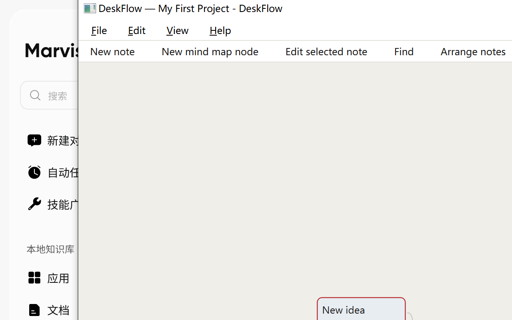
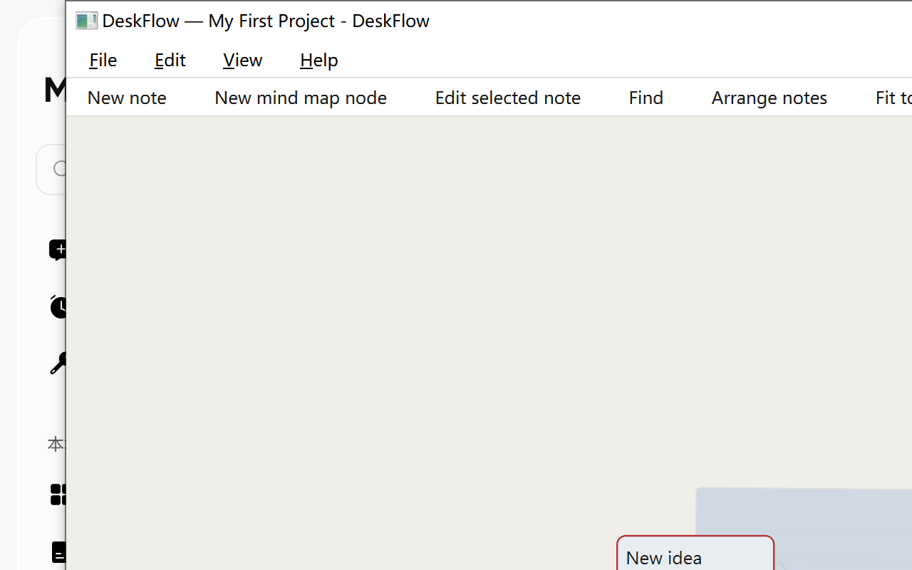
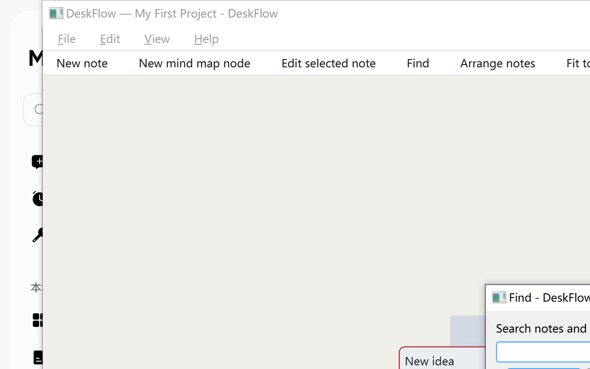

# DeskFlow 0.2.0

一块安静的桌面白板：便签 + 思维导图 + 任务清单 + 项目切换，全部数据只存在你自己的电脑上。

适合用来整理零散灵感、梳理需求脑图、盯着几件待办事项。没有联网、没有账号、没有云同步。

---

## 1. 运行

要求：**Python 3.9+**，依赖只有 PySide6。

```bat
:: 方式一：双击（首次运行会自动安装 PySide6）
run.bat

:: 方式二：命令行
pip install -r requirements.txt
python main.py

:: 方式三：把数据放到指定目录（多份资料分开管理）
python main.py --data-dir D:\DeskFlowData
python main.py --version
```

> Windows 下建议用 `pythonw main.py` 启动，可以不弹出黑色控制台窗口。

## 2. 界面展示

以下截图取自 0.2.0 默认主题。

### 主界面



画布 + 便签，右侧为悬停展开的抽屉侧栏（`Ctrl+B` 可固定）。

### 便签（`Ctrl+N`）


新建便签支持 8 种配色、字号调整、标签与右下角拖拽缩放。

### 思维导图（`Ctrl+M`）



根节点 / 子节点、平滑贝塞尔连线、逐节点配色。

### 任务与日历


侧栏中的任务清单，日历上标出到期日，支持按今天 / 本周 / 未完成筛选。

### 全局搜索（`Ctrl+F`）



搜索便签、标签与导图节点，命中后高亮闪烁定位。

## 3. 功能总览

| 模块 | 能力 |
| --- | --- |
| 便签 | 新建 / 编辑 / 复制 / 删除、8 种颜色、字号调整、标签、右下角拖拽缩放、删除后撤销 |
| 画布 | 缩放（Ctrl+滚轮）、平移（中键拖拽或 Space+拖拽）、适应内容、网格开关、一键整理、**空白处双击直接新建便签** |
| 思维导图 | 根节点 / 子节点、平滑贝塞尔连线、重命名、逐节点配色、删除整棵子树、自动尺寸 |
| 项目 | 多项目切换、重命名、项目路径、**误删项目可恢复**、导出 JSON / Markdown |
| 任务 | 待办清单、优先级、截止日期、日历上标出到期日、筛选（全部/今天/本周/未完成/已完成）、行内编辑 |
| 侧栏 | 悬停展开抽屉 + 图钉固定、项目快速切换、日历、标签、任务过滤 |
| 查找 | Ctrl+F 全局搜索便签、标签、导图节点，命中后高亮闪烁定位 |
| 数据安全 | 崩溃安全的 JSON 写入（`.bak` 兜底）、输入防抖保存、20 秒自动保存、删除项目进 `.trash`（保留最近 10 个，可一键恢复）、窗口大小位置记忆 |

## 4. 快捷键

| 快捷键 | 作用 |
| --- | --- |
| `Ctrl+N` | 新建便签 |
| `Ctrl+M` | 新建导图节点 |
| `Ctrl+E` | 编辑选中的便签 |
| `Ctrl+D` | 复制便签 |
| `Ctrl+F` | 搜索 |
| `Ctrl+Shift+Z` | 撤销上一次删除 |
| `Ctrl+B` | 显示/隐藏侧栏 |
| `Ctrl+S` | 立即保存 |
| `Ctrl+Shift+E` | 导出 Markdown |
| `Ctrl+滚轮` / `Ctrl+0` | 缩放 / 重置缩放 |
| `Delete` | 删除选中项（会先询问） |

画布空白处：**双击**新建便签；**中键拖拽**或 **Space+左键拖拽**平移。

## 5. 数据放在哪

程序优先把数据放在代码同级的 `data/` 目录；如果该目录不可写（例如装在 `Program Files`），自动回退到 `%APPDATA%\DeskFlow\data`。

```
data/
├── projects.json                 项目索引
├── settings.json                 窗口尺寸、上次打开的项目等
├── .trash/                       删除的项目（保留最近 10 个，可恢复）
└── projects/<项目 id>/
    ├── notes.json                便签
    ├── mindmaps.json             思维导图
    └── config.json               项目配置、任务清单
```

- **误删项目**：菜单 `File ▸ Restore deleted project…` 从 `.trash` 里选一个恢复。
- **数据损坏**：任一 JSON 写入失败都会保留上一份 `.bak`，读取时自动兜底。
- **备份**：直接复制整个 `data` 目录即可，格式是纯 JSON。
- **菜单 `Help ▸ Open data folder`** 可以直接在文件管理器里打开数据目录。

## 6. 目录结构

```
main.py                        入口：QApplication、全局样式、命令行参数
run.bat                        Windows 一键启动脚本
deskflow/                      应用包（业务代码全部收纳于此）
├─ __init__.py                 包说明与版本号
├─ config.py                   配色、尺寸、常量
├─ core/                       持久化与工具层（不依赖 Qt）
│   ├─ util.py                 id / 日期 / 标签 / 文本工具
│   ├─ storage.py              崩溃安全的 JSON 读写
│   └─ data_manager.py         项目、便签、任务、设置、导出、回收站
└─ ui/                         界面层
    ├─ main_window.py          主窗口：菜单、工具栏、快捷键、项目 / 任务逻辑
    ├─ sidebar.py              悬停抽屉：项目、日历、任务、标签
    ├─ canvas.py               画布与场景：便签与导图节点
    ├─ note.py                 便签图元与文本编辑
    ├─ mindmap.py              导图节点、连线、导图管理
    └─ editor.py               便签全屏编辑对话框
docs/screenshots/              界面截图，供本文档与项目展示引用
```

## 7. 常见问题

- **启动报 `ModuleNotFoundError: PySide6`**：执行 `pip install -r requirements.txt`，或直接双击 `run.bat`。
- **界面字体很小 / 模糊**：Qt 6 会跟随系统缩放；若用远程桌面或外接高分屏，注销重登一次让缩放生效。
- **第一次启动只有空项目**：属正常，会自动创建一个 `My First Project`。
- **想彻底重置**：关闭程序后删除 `data` 目录即可（不可恢复，请先备份）。
